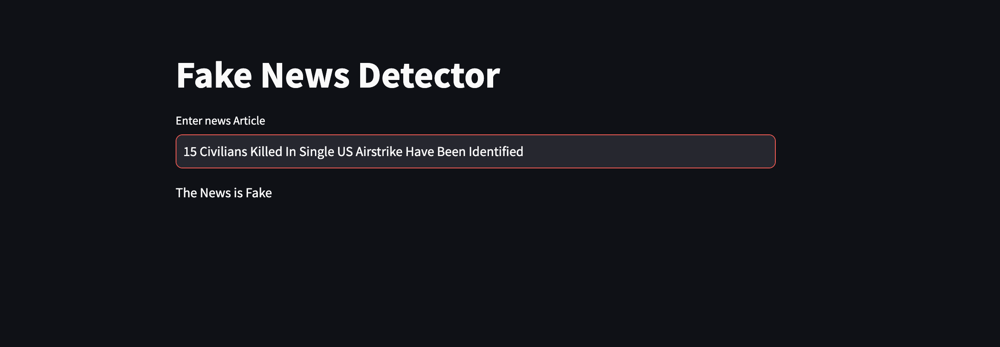

# Fake News Detector - Combating Misinformation with Machine Learning 🗞

## Description
Fake News Detector is an advanced machine learning project aimed at combatting the spread of misinformation and fake news on various online platforms. In today's digital age, fake news has become a significant challenge, leading to social unrest, distrust, and misinformation. This project strives to contribute to the efforts of building a more informed and responsible online community by identifying and flagging potentially fake news articles.

## Techstack:
* Fake News
* Machine Learning
* Deep Learning
* Natural Language Processing (NLP)
* Artificial Intelligence (AI)
* Data Science
* Text Classification
* News Analysis
* Information Security
* Journalism
* Media Literacy
* NLTK

## Key Feature:

* Machine Learning Model: The core of this project is a powerful machine learning model trained on a large dataset of news articles. The model utilizes natural language processing (NLP) techniques and algorithms to analyze the text's linguistic patterns, helping differentiate between genuine and fake news.

* Data Preprocessing: Extensive data preprocessing techniques are applied to clean and prepare the input text for analysis. This ensures optimal performance and accuracy of the model.

* Stopword Removal and Stemming: The implementation involves removing stopwords (commonly used words with little semantic value) and stemming (reducing words to their root form) to enhance the model's ability to identify meaningful patterns in the text.

* NLTK and Scikit-learn Integration: The project leverages the Natural Language Toolkit (NLTK) and Scikit-learn libraries, providing robust tools for text processing and machine learning tasks.

* User-friendly Interface: The project offers a user-friendly interface that allows users to input news articles and receive real-time feedback on the probability of the content being genuine or fake.

* Performance Metrics: The model's performance is assessed using various metrics, including accuracy, precision, recall, and F1-score, to ensure high-quality results.

## screenshot
When a news is fake 

when a news id Real

